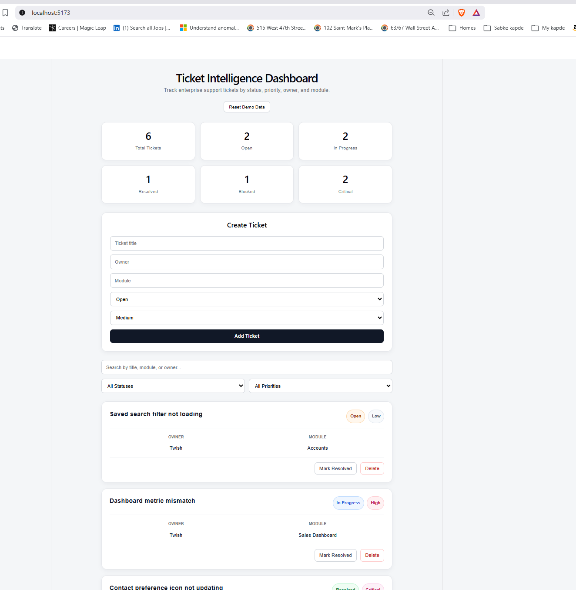

# Ticket Intelligence Dashboard

A React + TypeScript dashboard for tracking enterprise support tickets by status, priority, owner, and module.

## Project Context

This project simulates an internal operations dashboard for tracking production or support tickets across modules. It was built to practice TypeScript, React component design, filtering logic, form handling, CRUD-style ticket actions, and local persistence.

## Features

- Create new tickets with form validation
- Search tickets by title, module, or owner
- Filter tickets by status and priority
- View operational summary cards
- Mark tickets as resolved
- Delete tickets
- Reset demo data
- Persist changes using localStorage

## Screenshot



## Tech Stack

- React
- TypeScript
- Vite
- CSS
- localStorage

## What I Practiced

- Typed data models with TypeScript
- React state management with useState
- Side effects and persistence with useEffect
- Component decomposition
- Controlled forms
- Derived state for filtering and summary metrics
- Basic CRUD behavior

## Live Demo

- [View the live app on GitHub Pages](https://twishikana.github.io/ticket-intelligence-dashboard/)
- [View the live app on Vercel](https://ticket-intelligence-dashboard-7g6n48mvj-twishikana-s-projects.vercel.app/)

## Running Locally

```bash
npm install
npm run dev
```
